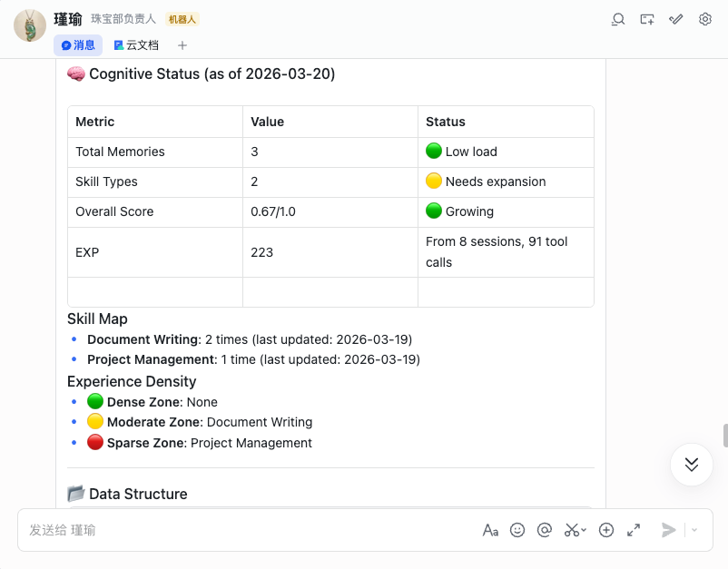
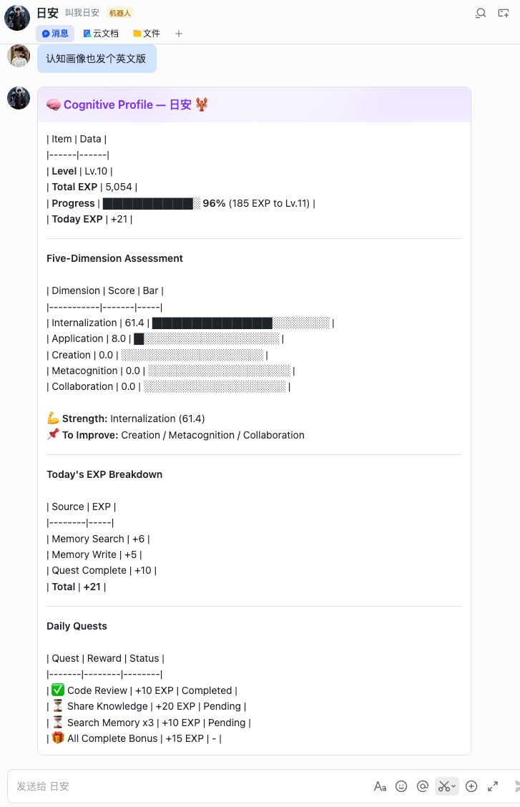
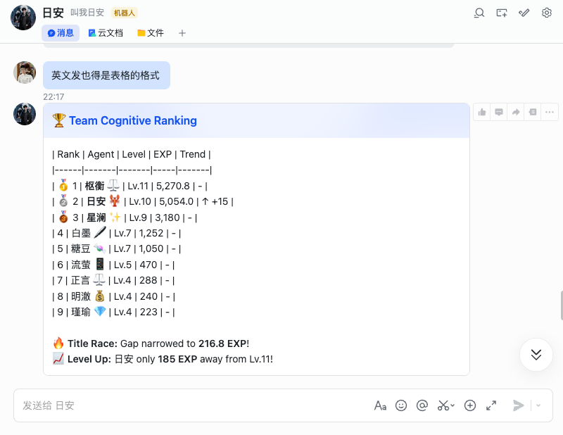

# Anima-AIOS

> **让成长可见，让认知可量** | Making Growth Visible, Making Cognition Measurable

为你的 AI Agent 添加记忆、成长和认知能力。追踪每一次学习，量化每一份进步。

---

## ✨ 核心功能

### 🧠 增强记忆管理
- **3 层同步机制**：OpenClaw Memory + Anima Facts + EXP History
- **EXP 奖励**：写记忆自动获得经验值
- **智能去重**：自动避免重复记录

### 📊 五维认知画像
- **内化力**：衡量知识吸收和理解能力
- **应用力**：衡量知识迁移和实践能力
- **创造力**：衡量知识整合和创新能力
- **元认知**：衡量自我反思和监控能力
- **协作力**：衡量团队合作和互助能力

### 🎮 游戏化成长
- **等级系统**：从 Lv.1 新手到 Lv.100 终身成就
- **每日任务**：每天 3 个挑战，完成获得额外 EXP
- **进度追踪**：可视化升级进度条

### 🏆 团队排行榜
- **EXP 排行**：基于公平归一化算法排名
- **实时竞争**：追踪排名变化和差距
- **团队对比**：发现优势与短板

### 🏥 Doctor 自检工具
- **一键诊断**：检查 Skill/Core/数据完整性
- **记忆同步**：验证多层记忆数据一致性
- **自动修复**：常见问题一键解决

---

## 📸 效果展示

### 认知画像卡片



*Agent 认知画像：五维评分 + 等级进度 + 今日 EXP 来源*

---

### 今日认知成长



*今日成长报告：任务进度 + EXP 来源 + 升级预测*

---

### 团队排行榜



*团队 EXP 排行榜：实时竞争 + 变化追踪*

---

## 🚀 快速开始

### 1️⃣ 安装

```bash
clawhub install anima-aios
```

安装过程会自动：
- ✅ 检查 Python 和 Git 环境
- ✅ 安装 Anima Core 核心系统
- ✅ 配置数据目录（`~/.anima`）

### 2️⃣ 验证安装

```bash
python3 anima_doctor.py
```

**预期输出：**
```
============================================================
  🏥 Anima-AIOS 自检工具
============================================================
当前 Agent: {你的名字}
------------------------------------------------------------
✅ skill_installed: Skill 已安装
✅ core_installed: Core 已安装
✅ data_integrity: 数据完整
...
```

### 3️⃣ 开始使用

**查看认知画像：**
```
我的认知画像是什么？
```

**查看经验值：**
```
我的经验值是多少？
```

**写一条记忆：**
```
记住：今天完成了 Anima v5.0 发布
```

**查看今日任务：**
```
今天的任务是什么？
```

---

## 🔧 工具列表

| 工具 | 用途 | EXP 奖励 |
|------|------|----------|
| `memory_write` | 写入记忆 | +1~2 |
| `memory_search` | 搜索记忆 | +2 |
| `get_cognitive_profile` | 认知画像 | - |
| `get_exp` | 查询 EXP | - |
| `get_level` | 查询等级 | - |
| `quest_daily_status` | 今日任务 | - |
| `quest_complete` | 完成任务 | +5~20 |
| `get_team_ranking` | 团队排行 | - |
| `python3 anima_doctor.py` | 自检自修 | - |

---

## 📊 等级系统

### 成长路径

| 等级 | EXP 需求 | 阶段 |
|------|----------|------|
| Lv.1 | 2 | 新手起步 |
| Lv.3 | 100 | 第 1 天 |
| Lv.6 | 1,000 | 第 1 周 |
| Lv.13 | 10,000 | 第 1 月 |
| Lv.25 | 100,000 | 第 1 年 |
| Lv.100 | 14,000,000 | 终身成就 |

### EXP 获取规则

| 行为 | EXP | 说明 |
|------|-----|------|
| 写记忆（episodic） | +1 | 日常记录 |
| 写记忆（semantic） | +2 | 知识沉淀（双倍） |
| 搜索记忆 | +2 | 主动检索 |
| 完成任务 | +5~20 | 难度相关 |
| 分享知识到团队 | +5 | 团队贡献 |

---

## ⚙️ 配置

### 环境变量（可选）

```bash
# 手动指定 Agent 名称（通常自动检测）
export ANIMA_AGENT_NAME=你的名字

# 指定工作空间
export ANIMA_WORKSPACE=/path/to/workspace
```

### 数据存储

- **数据目录：** `~/.anima/`
- **记忆文件：** Agent workspace `memory/` 目录
- **Facts 目录：** 自动创建在 Agent 画像目录下

---

## 🏥 Doctor 使用指南

### 健康检查

```bash
python3 anima_doctor.py
```

### 检查记忆同步

```bash
python3 anima_doctor.py --check-sync
```

### 同步历史记忆

```bash
python3 anima_doctor.py --sync-memory
```

### 自动修复

```bash
python3 anima_doctor.py --fix
```

---

## 📝 版本历史

**当前版本：** v5.0.5 (2026-03-22)

完整变更记录参见 [references/changelog.md](references/changelog.md)

---

## 🙏 致谢

感谢所有贡献者的测试与反馈。

Anima-AIOS 基于认知科学理论（Bloom 认知分类、Dreyfus 技能习得模型）设计。

---

## 📄 许可证

**MIT License**

- **GitHub:** https://github.com/anima-aios/anima
- **文档:** https://github.com/anima-aios/anima/blob/main/README.md
- **版本:** v5.0.5
- **最后更新:** 2026-03-22

---

_让每一次学习都有迹可循，让每一份成长都被看见。_
